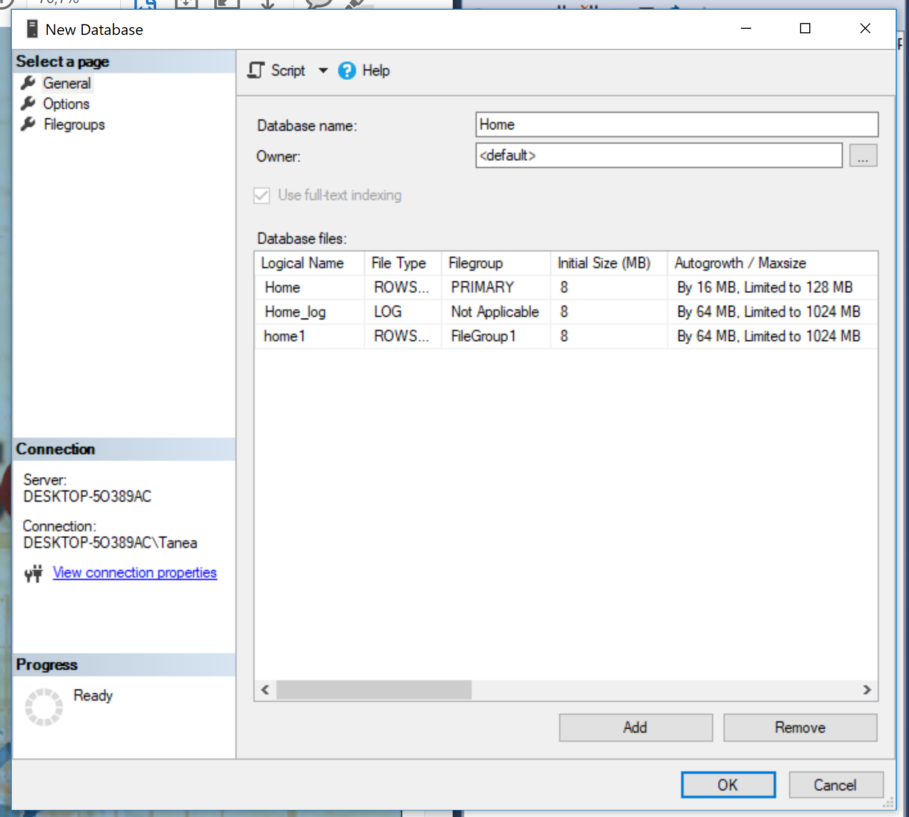
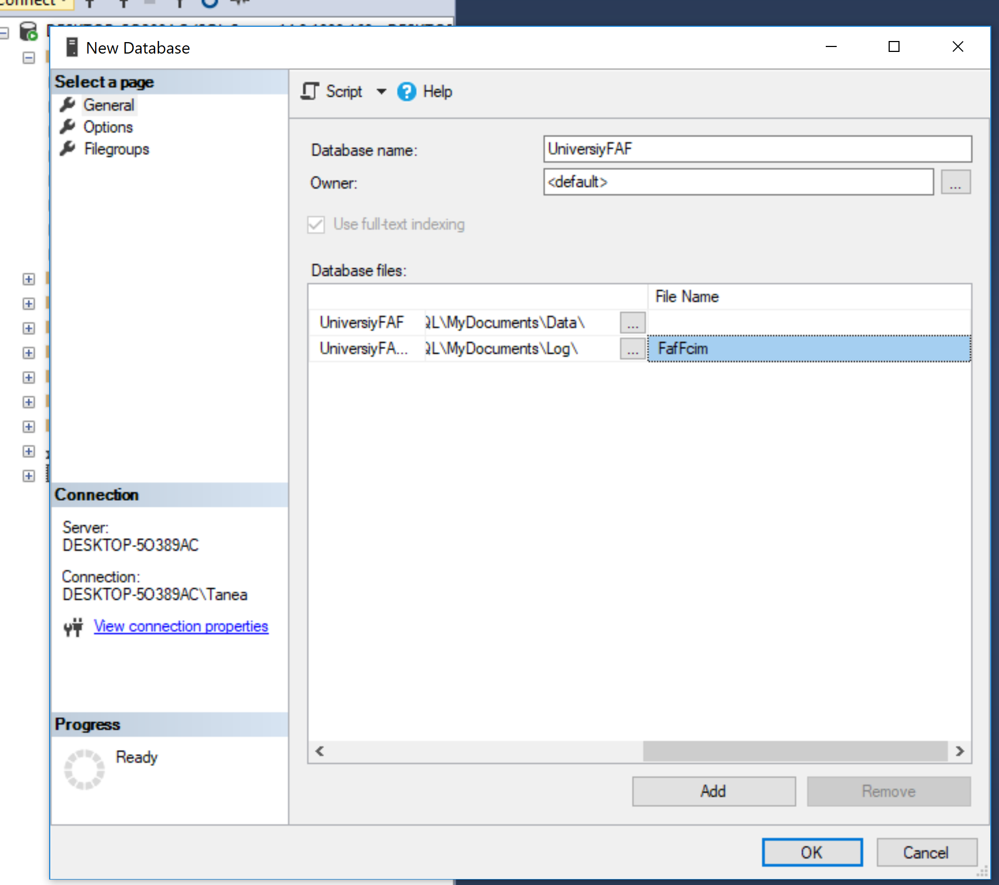
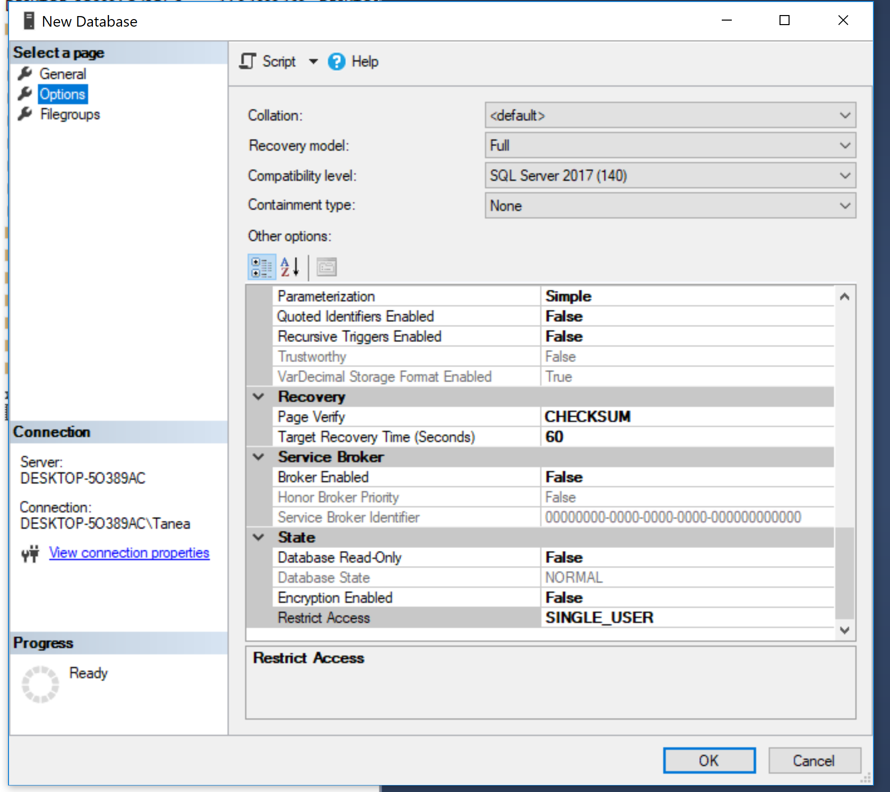
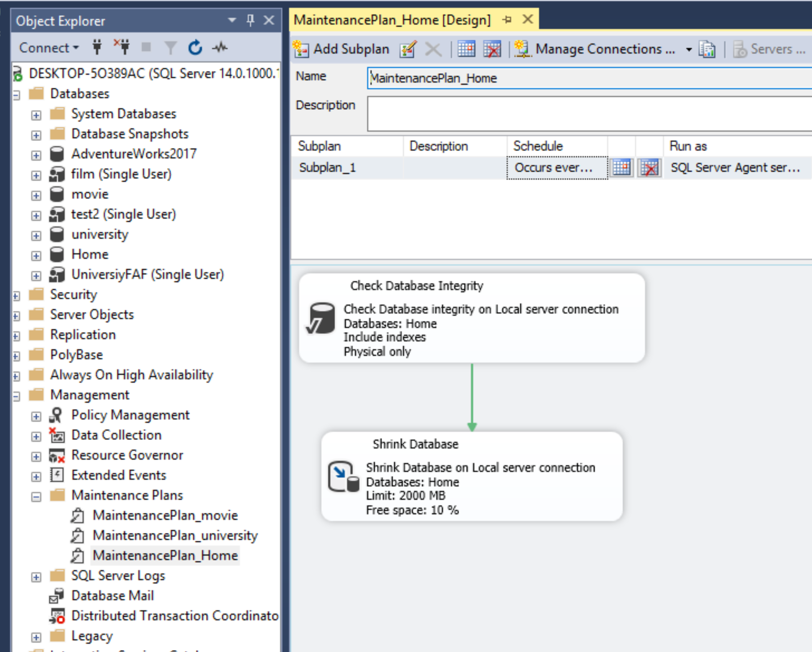
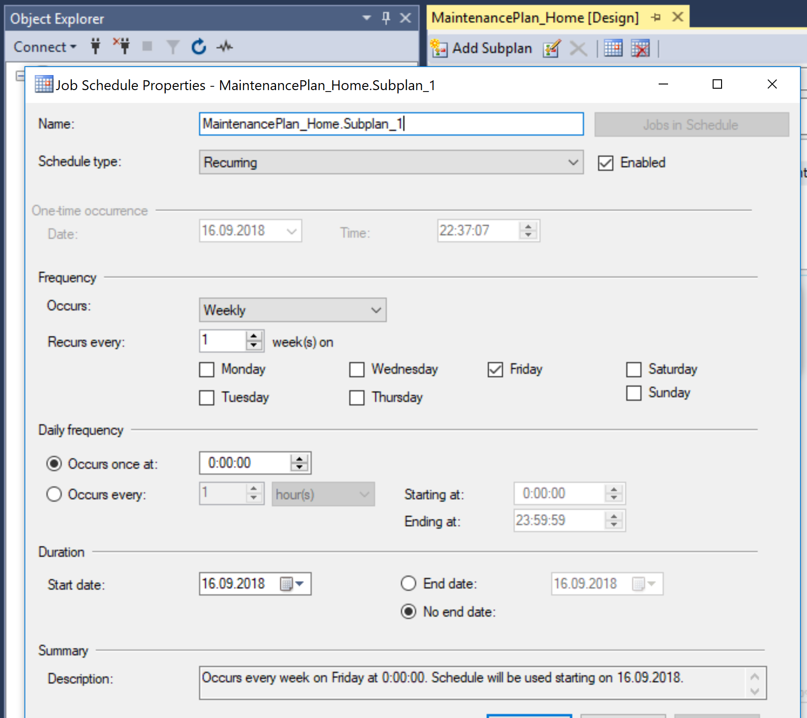
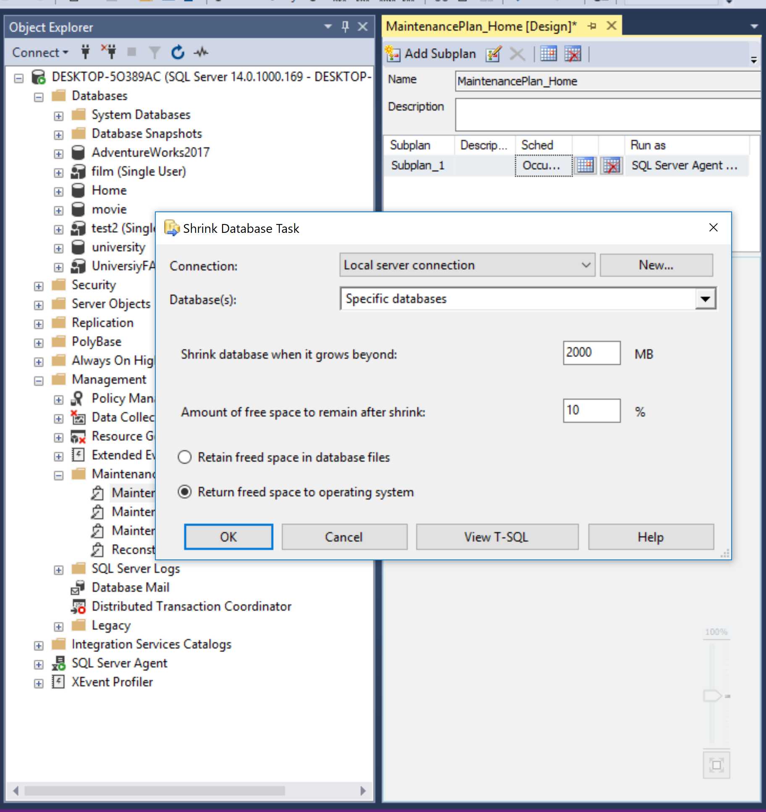
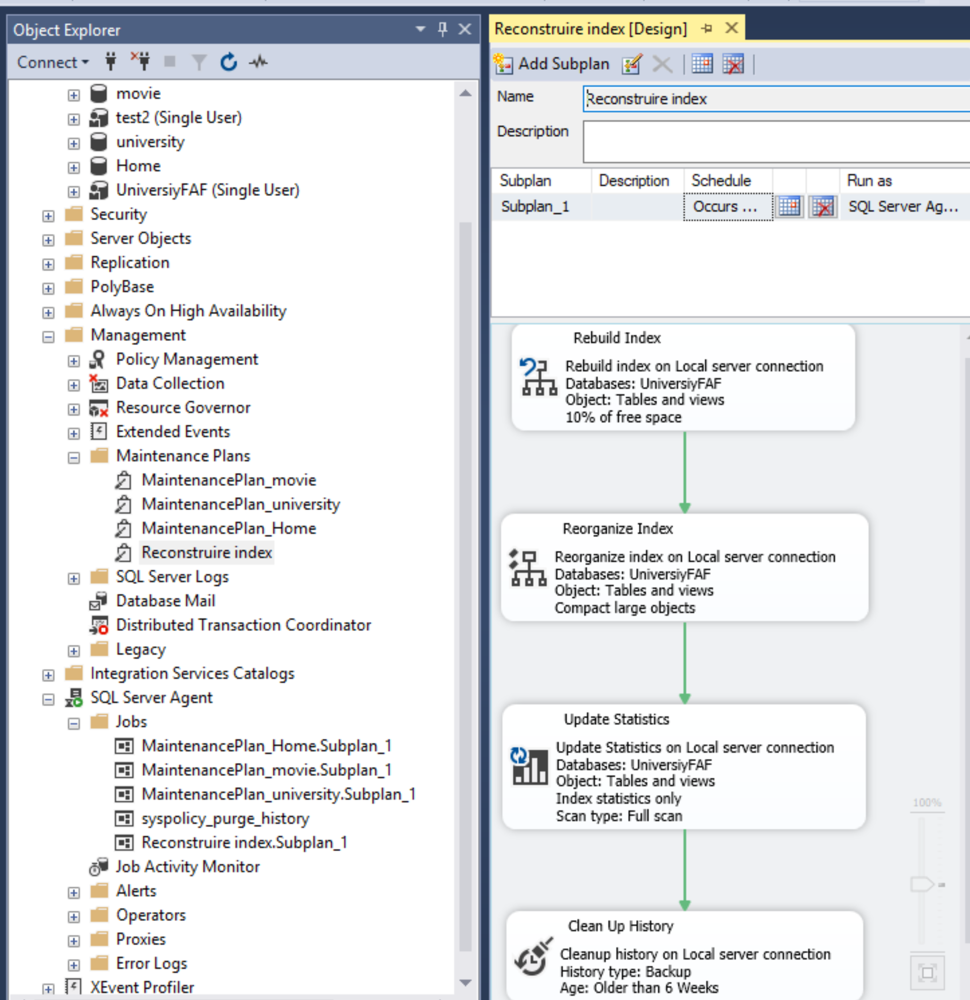

# Laboratory-nr1
SQL laboratories
<h2>Task 1.</h2>
       
 I created a new database named "Home" with some given properties </>
       <h1> </h1>
       
<h2>Task 2.</h2>
       
 I created another database named "UniversityFAF" where the log file name differs from it's logical one

       
       
 The database is accessible only for one user

       
<h2>Task 3.</h2>
       
 I created the Maintenance plan  named MentenancePlan_Home for the first database 

       
       
 The plan runs every Friday at 00:00 

       
       
 Unused space from database files is removed when reaching the limit of 2000Mb 

       
<h2>Task 4.</h2>
       
 I created the Mentenance Plan named "Reconstruire index" for my second database  

              
