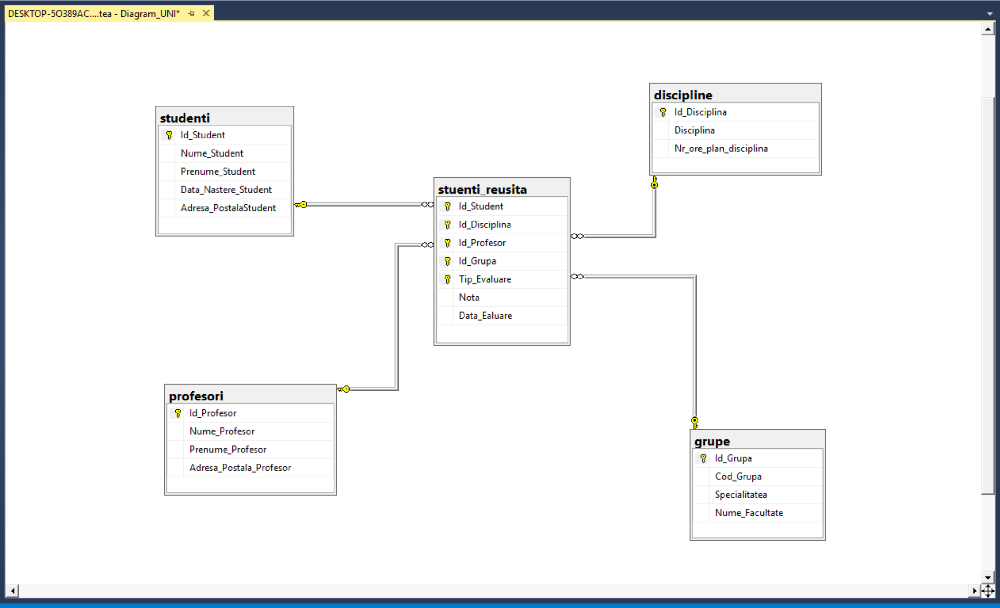
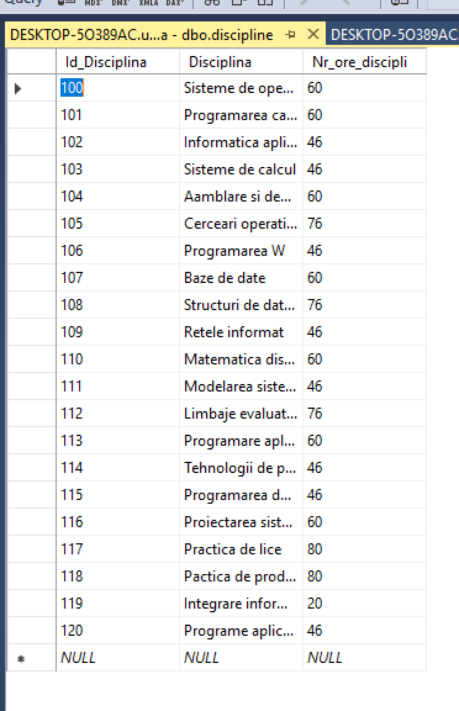
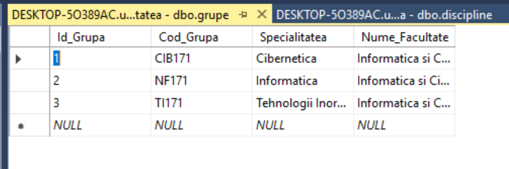

# Laboratory-nr3
SQL laboratories

I have created those 5 tables with the goven properties: discipline,grupe,studenti,profesori, reusita_studenti and made the relations between them and made a database diagram.
 

I felt in the tables grupe and discipline with the diven data:

Then i made the backup of the database.

